# Safe Space — Test Suite

> 💡 **Reading tip** — open this file in VSCode's markdown preview for better rendering: `Ctrl+Shift+V` on Windows/Linux, `Cmd+Shift+V` on Mac.

This document collects every automated test in the project and demonstrates that each one passes both locally and in continuous integration. Tests are written with **Vitest** (a fast JavaScript test runner) and use **Supertest** on the backend to simulate HTTP requests, and **React Testing Library** on the frontend to mount components in a virtual browser.

---

## Summary

| Suite     | Files  | Tests  | Tool stack                             |
| --------- | ------ | ------ | -------------------------------------- |
| Backend   | 5      | 19     | Vitest + Supertest                     |
| Frontend  | 7      | 30     | Vitest + React Testing Library + jsdom |
| **Total** | **12** | **49** |                                        |

Backend test files marked **New** below were added during the deployment phase to meet the requirements for at least two production-like tests.

To run a single file locally and capture its output:

```bash
cd server && npx vitest run --reporter=verbose tests/integration/<file>.test.ts
cd client && npx vitest run --reporter=verbose src/<path>/<file>.test.tsx
```

To run the full suite per service:

```bash
cd server && npm test
cd client && npm test
```

---

## Backend tests

The backend has 19 integration tests across 5 files, all under [server/tests/integration/](../server/tests/integration/).

### `auth.test.ts` — Auth middleware enforcement

Verifies that protected routes reject unauthenticated requests with `401 Unauthorized`, and that `GET /spaces` remains public.

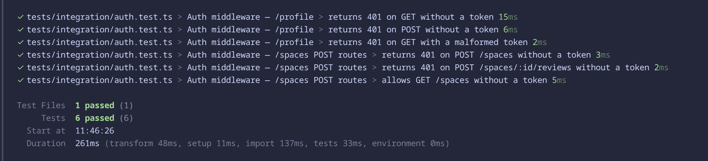

### `auth-success.test.ts` — Authenticated route bypass

Verifies that, with a mocked successful authentication, protected routes return their expected success responses. Pairs with `auth.test.ts` to prove the middleware allows valid tokens through, not just blocks invalid ones.

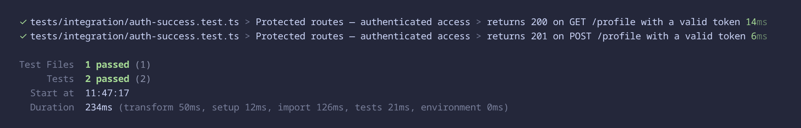

### `space.test.ts` — Spaces controller

Exercises the spaces API end-to-end with the authentication middleware mocked out. Confirms list / detail / 404 / create / review flows.

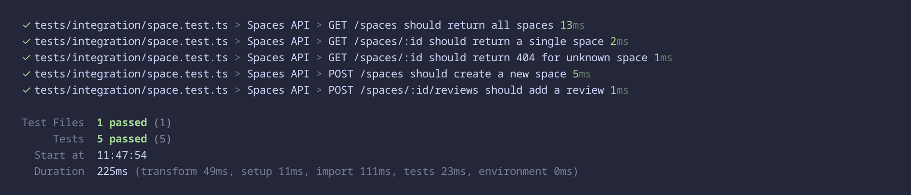

### `cors.test.ts` — Production-like CORS allow-list

> 💡 **New** — added during the deployment phase.

Verifies that the cross-origin policy enforces the allow-list configured via `CLIENT_ORIGIN` and properly responds to preflight requests, with credentials enabled.

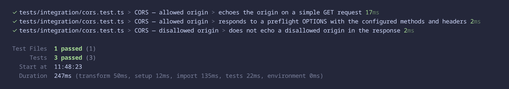

### `health.test.ts` — Production-like health endpoint

> 💡 **New** — added during the deployment phase.

Verifies that the `/health` endpoint used by Render's health probe is always reachable, regardless of authentication or `Origin` headers (it is mounted before any auth or CORS middleware).

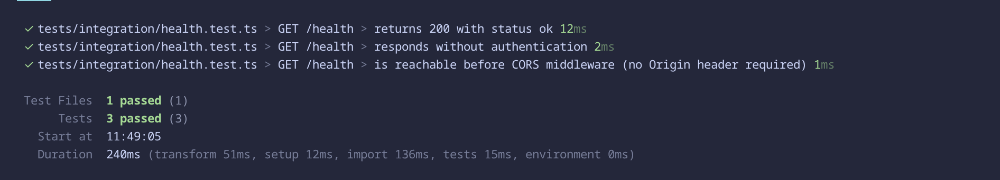

---

## Frontend tests

The frontend has 30 tests across 7 files. Component tests live in [client/src/components/__tests__/](../client/src/components/__tests__/) and page tests in [client/src/pages/__test__/](../client/src/pages/__test__/).

### Component tests

#### `PlaceInfo.test.tsx`

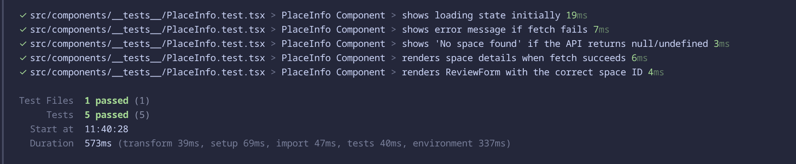

#### `PlaceList.test.tsx`

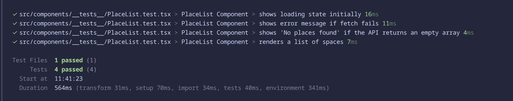

#### `ReviewForm.test.tsx`

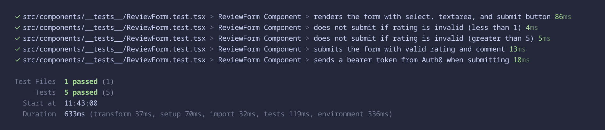

### Page tests

#### `Browse.test.tsx`

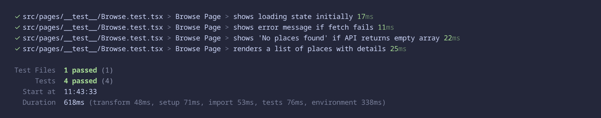

#### `Cards.test.tsx`

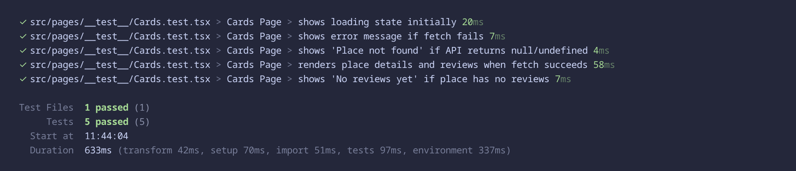

#### `Login.test.tsx`

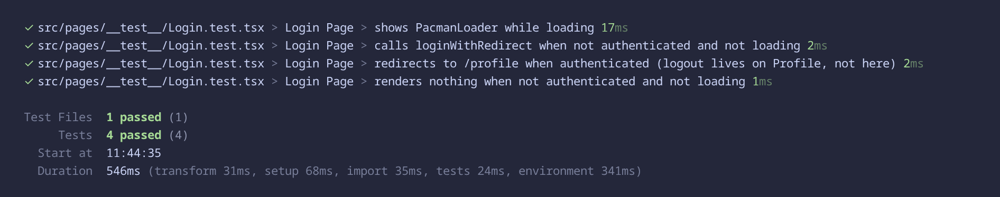

#### `Profile.test.tsx`

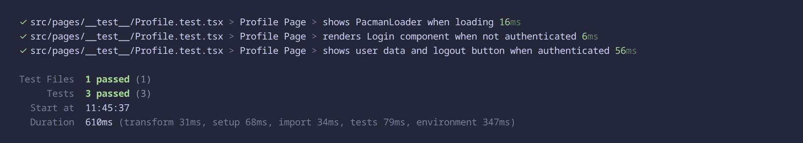

---

## Continuous Integration

The same test suites run automatically on every pull request to the `main` branch via GitHub Actions. The workflows are defined in [.github/workflows/](../.github/workflows/):

- [server.yml](../.github/workflows/server.yml) — runs the backend test suite
- [client.yml](../.github/workflows/client.yml) — runs the frontend test suite
- [deploy.yml](../.github/workflows/deploy.yml) — runs both suites on push to `main`, then deploys to Render + Vercel via API if everything passes

### Backend tests in CI (`server.yml`)

Runs on every pull request to `main`.

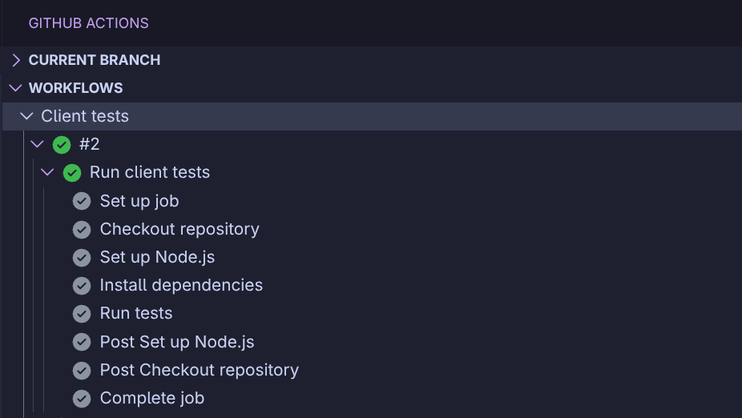

### Frontend tests in CI (`client.yml`)

Runs on every pull request to `main`.

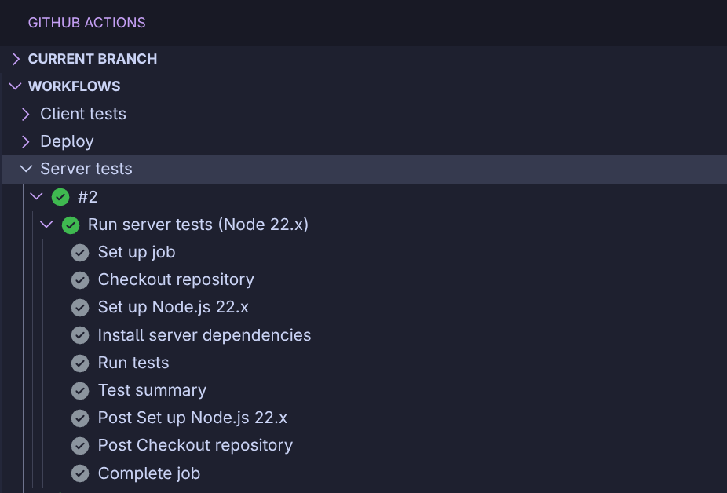

### Deploy workflow (`deploy.yml`) — the full Pattern A gate

> 💡 **New** — the test-gated deploy was built during the deployment phase.

Runs on every push to `main`. Has four jobs: server tests + client tests run in parallel, and both deploy jobs (Render + Vercel) only run if both test jobs pass. All four green means the gate worked end-to-end — tests passed, both deploys worked.

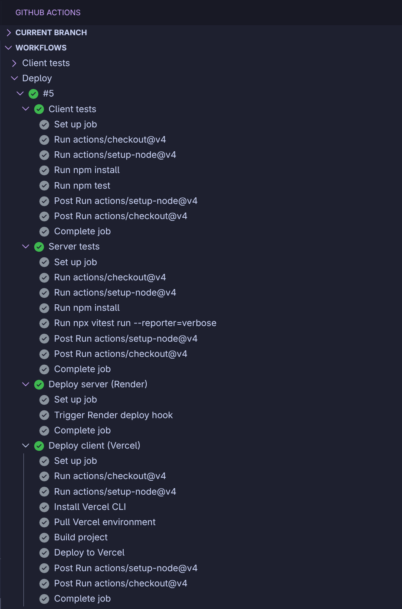
